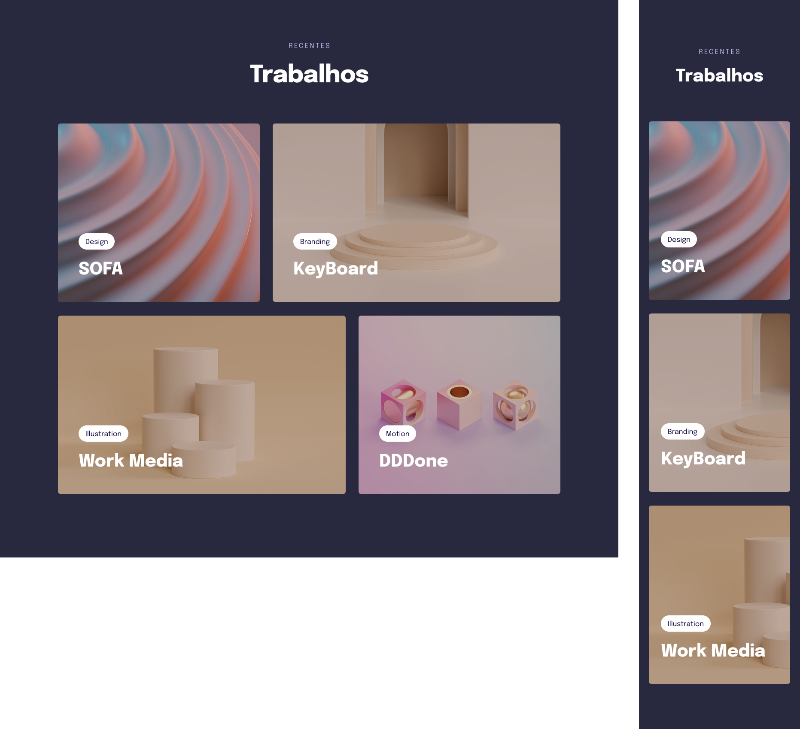

  

## 🚀 Tecnologias

Esse projeto foi desenvolvido com as seguintes tecnologias:

- [HTML](https://developer.mozilla.org/pt-BR/docs/Web/HTML)
- [CSS](https://developer.mozilla.org/pt-BR/docs/Web/CSS)

## 💻 Projeto

Esse projeto tem como finalidade colocar em prática os conceitos de display grid, ele foi elaborado na aula do programa Explorer da Rocketseat.

- [Página](https://igorsilvam.github.io/Atelier/)

## 🔖 Layout

Nos links abaixo você encontra o layout do projeto web e também do mobile. Lembrando que você precisa ter uma conta no [Figma](http://figma.com/) para acessá-lo.

- [Layout Web / Mobile](<https://www.figma.com/file/tOBDd4SBJ9OprkKfKrBlSr/Explorer-Stage-03-Projeto-03-(Copy)?node-id=203%3A1865>)
